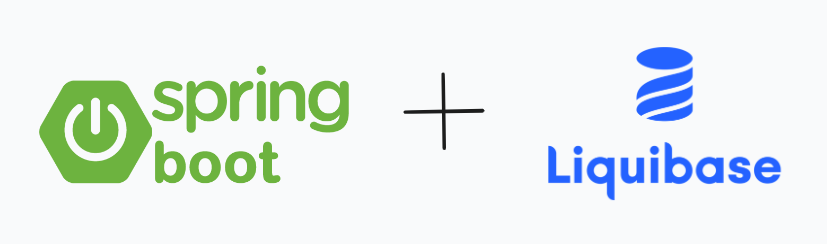

# Spring Boot + Liquibase
Spring Boot application demonstrates how to integrate Liquibase library for tracking, managing and applying database schema changes.


----------------------------------------------------
### Pre-requisite

* JDK 17
* IntelliJ IDE
* Postgres DB

----------------------------------------------------

### Introduction

#### How Liquibase works?



Liquibase reads the `xml changelog` file and figures out what changesets it needs to apply. 
It uses the` DATABASECHANGELOG` table in your DB (DataSource) for this purpose. 
The `DATABASECHANGELOG` contains the list of changesets that are already applied with their `ID`, `FILENAME`, `MD5SUM`, `AUTHOR` and few other properties.

The logic is relatively simple. Just by comparing the changelog with the table `Liquibase` knows what changesets it needs to apply. There are, however, few gotchas ...

* `Liquibase` can only take one changelog file.
* `Liquibase` determines the list of changesets to apply before applying them.
* The actual DB can get out of sync with the `DATABASECHANGELOG` table. E.g. if you manually modify database, or so on.
* If `Liquibase` fails to apply a changeset, it fails immediately and won't continue with next datasets
* If `Liquibase` is running in Spring app as a bean, it executes during application startup, hence if it fails, then the application won't start
* Changesets are not atomic. It can happen that part of the changeset passes, it modifies the DB properly, and next part fails. 
The changeset record won't go into `DATABASECHANGELOG` table. Hence, it leaves the DB in the state that requires manual repair (e.g. reverting the part of the changeset and letting Liquibase to run again).
* The changesets can't be modified. If you modify changeset after it was applied in your db, then Liquibase fails stating that the MD5SUM doesn't match.
* The ID is not the unique identifier of the changeset. It is in fact the combination of `ID`, `FILENAME` and `AUTHOR`.
* The changesets that are in the `DATABASECHANGELOG` and are not in the changelog files are ignored.

### Define multiple changelog files

```xml
<?xml version="1.0" encoding="UTF-8"?>
<databaseChangeLog xmlns="http://www.liquibase.org/xml/ns/dbchangelog"
                   xmlns:xsi="http://www.w3.org/2001/XMLSchema-instance"
                   xsi:schemaLocation="http://www.liquibase.org/xml/ns/dbchangelog
                                       https://www.liquibase.org/xml/ns/dbchangelog/dbchangelog-4.15.xsd">

    <include file="sprint-1/sprint-1.xml" relativeToChangelogFile="true"/>
    <include file="sprint-2/sprint-2.xml" relativeToChangelogFile="true"/>
    <include file="sprint-3/sprint-3.xml" relativeToChangelogFile="true"/>
    <include file="sprint-4/sprint-4.xml" relativeToChangelogFile="true"/>
</databaseChangeLog>
```

### Spring Boot YAML Configuration

```yaml
spring:
  datasource:
    url: jdbc:postgresql://localhost:5432/postgres
    username: postgres
    password: pass
  liquibase:
    change-log: classpath:db/changelog/changelog.xml
```

### Configure Multiple Liquibase Runs

Since one run can only take one changelog file, just define multiple changelog files and let the Liquibase run multiple times.

In your Spring (Boot) app just define multiple liquibase beans:

```java
import liquibase.integration.spring.SpringLiquibase;
import org.springframework.context.annotation.Bean;
import org.springframework.context.annotation.DependsOn;

import javax.sql.DataSource;

@Configuration
public class MultipleLiquibaseConfiguration {

    @Bean
    public SpringLiquibase liquibaseRelease1(DataSource dataSource) {
        SpringLiquibase liquibase = new SpringLiquibase();
        liquibase.setDataSource(dataSource);
        liquibase.setChangeLog("classpath:release_v1.xml");

        return liquibase;
    }

    @Bean
    public SpringLiquibase liquibaseRelease2(DataSource dataSource) {
        SpringLiquibase liquibase = new SpringLiquibase();
        liquibase.setDataSource(dataSource);
        liquibase.setChangeLog("classpath:release_v2.xml");

        return liquibase;
    }
}
```

----------------------------------------------------
### Building and running
To build and run the application, execute the following commands:

* During the build process, all unit tests will be executed in a separate `Docker` container, to be sure that all `Liquibase` scripts are applied.

```shell
mvn clean package
```

* Once the application is started, the `Liquibase` scripts will be applied in your local PostgresSQL Database and you will be able to see all tables.

```shell
mvn spring-boot:run
```

Logs from the `Liquibase` executed scripts:

```console
2024-02-13T14:25:36.749+01:00  INFO 9260 --- [           main] liquibase.util                           : UPDATE SUMMARY
2024-02-13T14:25:36.750+01:00  INFO 9260 --- [           main] liquibase.util                           : Run:                          4
2024-02-13T14:25:36.750+01:00  INFO 9260 --- [           main] liquibase.util                           : Previously run:               0
2024-02-13T14:25:36.750+01:00  INFO 9260 --- [           main] liquibase.util                           : Filtered out:                 0
2024-02-13T14:25:36.750+01:00  INFO 9260 --- [           main] liquibase.util                           : -------------------------------
2024-02-13T14:25:36.751+01:00  INFO 9260 --- [           main] liquibase.util                           : Total change sets:            4
```
----------------------------------------------------
